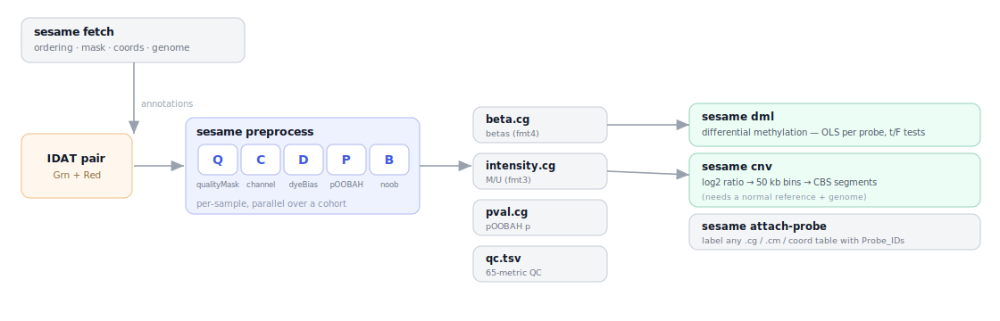
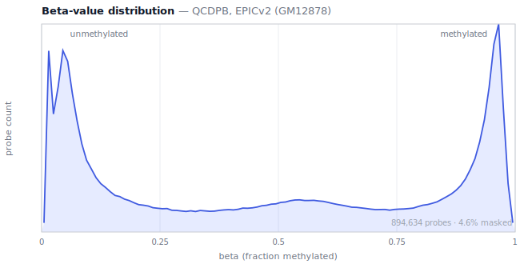
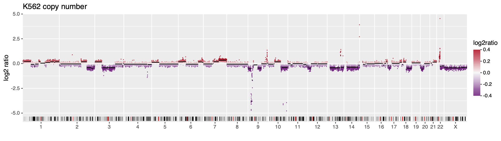

# sesame-cli


Infinium DNA-methylation analysis as a single C binary — **IDAT → betas → QC,
differential methylation, and copy number** — with no R and no Bioconductor. A
standalone reimplementation of [sesame](https://github.com/zwdzwd/sesame) /
`openSesame`, validated against the R package as a permanent oracle.



📖 **[Documentation site](https://zwdzwd.github.io/sesame-cli/)** ·
🔬 [Fidelity & numerics](NUMERICS.md)

## What it does

- **Read IDATs** — `readIDATpair`, **bit-identical** to R on 33/33 test files
  (~20.4M bead records, 9 platforms, plain and gzipped).
- **Preprocess to betas** — the full `QCDPB` pipeline (qualityMask,
  inferInfiniumIChannel, dyeBiasNL, pOOBAH, noob); `prep=""` betas are
  bit-identical to R, the rest match to documented tolerances.
- **QC** — the 65-metric `sesameQC` panel, one row per sample.
- **Differential methylation** — per-probe OLS with t/F tests and BH adjustment
  (`DML`), matching R's `lm` to ~1e-9.
- **Copy number** — log2 ratios vs a normal panel, genome binning, and a
  deterministic port of DNAcopy's **circular binary segmentation**.
- **SNP genotyping** — genotype the array's `rs` probes into a VCF
  (`formatVCF`); genotype calls and variant fractions are exact vs R.
- **Scale** — a cohort runs in one process across a thread pool, streaming to
  compact YAME `.cg` files; a bad IDAT never aborts the run.

Arrays: **EPIC, EPICv2, HM450, MSA**. Outputs are [YAME](https://github.com/zhou-lab/YAME)
`.cg` files, readable with `yame` or `libsesame`.

## Install

```sh
# conda (recommended) — installs the `sesame` binary; deps are zlib + libcurl
conda install -c zhou-lab -c conda-forge sesame-cli
```

Or build from source (a C compiler + `make`, `zlib`, `libcurl`, and the bundled
**YAME** submodule):

```sh
git clone --recurse-submodules https://github.com/zwdzwd/sesame-cli
cd sesame-cli && make          # builds YAME/htslib from the submodule, then ./sesame
cp sesame ~/.local/bin/         # put it on PATH
```

The binary is `sesame`. At runtime it needs only zlib and libcurl (YAME/htslib
are linked statically); the `yame` tool need not be installed.

## Quickstart

```sh
# 1. one-time: fetch a platform's annotation (ordering + mask + coords) into the store
sesame fetch EPICv2

# 2. preprocess a cohort (default QCDPB) -> one indexed .cg per output + qc.tsv
#    each arg is an IDAT prefix, or a directory searched recursively for pairs
sesame preprocess --out out/ idats/
#    -> out/beta.cg  out/intensity.cg  out/pval.cg  out/qc.tsv

# 3a. differential methylation from the betas
sesame dml --betas out/beta.cg --index EPICv2.ordering.tsv.gz \
           --meta samples.tsv --formula '~ group + age' > dml.tsv

# 3b. copy number for a tumor sample (writes segments + bins)
sesame fetch genome hg38
sesame preprocess --prep "" --raw-signal --output total_intensity --out t/ tumor
sesame cnv --platform EPICv2 t/total_intensity.cg out/segments.tsv out/bins.tsv
```

Everything is offline except `sesame fetch`. Annotation is downloaded once,
verified against a digest compiled into the build, and reused.

## Commands

```
sesame preprocess   [options] <prefix|dir> [...]       # IDAT -> YAME .cg (+ qc.tsv)
sesame dml          --betas <beta.cg|matrix.tsv> (--formula .. --meta .. | --design ..)
sesame cnv          [--probes] [--platform P] <target.cg> <segments.tsv> <bins|probes.tsv>
sesame vcf          <prefix> [--platform P] --snp <snp.tsv.gz>     # SNP genotypes -> VCF
sesame mliftover    --to <platform> --platform <src> <in.cg> <out.cg>  # cross-platform betas (mLiftOver)
sesame impute       --method <mean|neighbors> <in.cg> <out.cg>    # fill NA betas
sesame region       (<chr:beg-end>|--gene NAME) --betas <beta.cg> # region betas -> long-form TSV
sesame deidentify   [--randomize|-r --seed N] <prefix|idat>        # strip SNP fingerprint from IDAT
sesame attach-probe [--platform P] <file.cg|.cm|.tsv>  # label a positional file with Probe_IDs
sesame fetch        [<platform>] | genome [<build>]    # download annotation into the store
sesame index-info                                      # store location + pinned tag + platforms
sesame idat-dump    [--head N] [--tsv] <file.idat[.gz]># inspect a raw IDAT
sesame version
```

---

## Preprocess — IDAT → betas

`preprocess` applies `--prep` (default `QCDPB`, `openSesame`'s default) to each
sample and writes one **YAME `.cg`** per requested output over the whole cohort —
one indexed file, one block per sample — into `--out DIR` (default `.`), plus a
`qc.tsv`.



| `--output` (comma list) | file | format |
|---|---|---|
| `beta` | `beta.cg` | 4 — float32 beta; NA = masked |
| `intensity` | `intensity.cg` | 3 — M/U integers (`yame` derives beta **and** coverage) |
| `total_intensity` | `total_intensity.cg` | 4 — M+U float |
| `pval` | `pval.cg` | 4 — pOOBAH detection p |
| `qc` | `qc.tsv` | the 65-metric `sesameQC` panel, one row per sample |

Default `--output` is `beta,intensity,pval,qc`.

```sh
sesame preprocess --out out/ idats/                           # a folder, searched recursively
sesame preprocess --output beta --out out/ pfx1 pfx2          # explicit prefixes -> just beta.cg
sesame preprocess --output total_intensity --raw-signal --out cnv/ tumor  # CNV input
sesame preprocess --prep "" --out raw/ pfx1                   # raw (bit-identical to R) betas
```

Signal outputs (`intensity`, `total_intensity`) reflect the prep; `--raw-signal`
takes them from the raw signal (what CNV wants). Other flags: `--index`/`--platform`
(else auto-detected from bead count), `--min-beads N`, `--threads N`, `--tmp DIR`.
Samples run in parallel; a failed sample becomes an NA block and the exit code is 1.
See [Batch mode](#batch-mode) and [The QCDPB pipeline](#the-qcdpb-pipeline).

## Differential methylation — `dml`

Per-probe **differential methylation**: for each probe, an OLS of its betas across
samples on a design, giving per-coefficient estimates and t-tests, a holdout
F-test per categorical variable, effect sizes, and BH-adjusted p-values — sesame's
`DML` / `summaryExtractTest`, as a TSV (one row per probe).

```sh
sesame dml --betas out/beta.cg --index EPICv2.ordering.tsv.gz \
           --meta samples.tsv --formula '~ group + age' > dml.tsv
```

`--betas` is a `preprocess` `beta.cg` (with `--index <ordering>` to resolve probe
IDs, since a `.cg` is positional) or a `Probe_ID` matrix TSV; `--meta`'s first
column matches the sample names. `--formula` takes **main effects** (categorical
columns auto-dummied to match R's `model.matrix` — treatment contrasts,
alphabetical levels; continuous as-is, with an intercept). For interactions or
splines, build the design elsewhere and pass `--design <numeric.tsv>` (first
column = sample id). Runs in parallel (`--threads`). Because it consumes a betas
matrix, there is no data-lineage caveat — it matches R's `lm` to ~1e-9.

## Copy number — `cnv`

For each sample in the target `total_intensity.cg`, regress its per-probe total
intensity on a panel of normals (OLS), then `log2(target / max(fitted, 1))` per
probe — sesame's `cnSegmentation`. Probes are binned along the genome (50 kb tiles
minus assembly gaps, merged to ≥ `--min-probes`), each bin takes the median probe
signal, and the bins are segmented by **circular binary segmentation** (a
deterministic port of DNAcopy's CBS).



```sh
# <target.cg> <segments.tsv> <bins.tsv> are all required, positional:
sesame cnv --platform EPICv2 t/total_intensity.cg out/segments.tsv out/bins.tsv
# --probes writes per-probe log2 to the detail file instead of per-bin:
sesame cnv --platform EPICv2 --probes t/total_intensity.cg out/segments.tsv out/probes.tsv
```

`--normals`, `--coords`, and the ordering default to the fetched store for
`--platform` (`<store>/<P>/<P>.cnvnormals.cg`, `<P>.hg38.coord.tsv.gz`); genome
tiling comes from `sesame fetch genome <--genome>` (default hg38). Both output
files carry a leading `sample` column — segments: chrom/start/end/nbin/seg.mean;
bins: chrom/start/end/nprobes/log2ratio; probes: Probe_ID/chrom/pos/log2ratio.
The fit + log2 matches R's `lm` to ~1e-5 on identical inputs; CBS recovers 97% of
DNAcopy's breakpoints with exact locations (DNAcopy's permutation significance is
itself unseeded, so an exact match is impossible — see `NUMERICS.md`). The figure
above is real `sesame cnv` output for K562.

## SNP genotyping — `vcf`

Genotype the array's SNP (`rs`) probes and write a sites-only VCF — sesame's
`formatVCF`. Per SNP probe it forms a variant fraction (`1-beta` for an ALT bead,
the out-of-band Type-I allele fraction for a channel-switch probe, else `beta`),
then a binomial model calls `0/0`, `0/1`, or `1/1` with a phred-like score in the
`INFO` field.

```sh
sesame vcf tumor --platform EPICv2 --snp EPICv2.hg38.snp.tsv.gz > geno.vcf
sesame vcf tumor --platform EPICv2 --snp EPICv2.hg38.snp.tsv.gz --variants > geno.vcf
```

It uses the **raw** signal (channel inference would erase the Type-I channel-switch
genotype). `--snp` is the platform's `<platform>.<genome>.snp.tsv.gz` (or the store
default). `--variants` keeps only the informative probes — rs and channel-switching
— dropping the non-switching Infinium-I bulk (~99% of rows) that almost never call
a variant. Genotype calls and variant fractions are **exact** vs R's `formatVCF`
(the quality score differs on ~0.01% of probes in the deep tail; see `NUMERICS.md`).

## Utilities

**`attach-probe`** — a YAME `.cg`/`.cm` and the per-probe coordinate tables are
**positional** (one row per probe in ordering order, no `Probe_ID` column inside).
This prepends the ordering's `Probe_ID` and prints a labeled TSV — greppable,
joinable:

```sh
sesame attach-probe --platform MSA MSA.hg38.coord.tsv.gz         # coord + Probe_ID
sesame attach-probe --platform MSA --all MSA.hg38.mask.cm        # every mask set, per probe
sesame attach-probe --index ord.tsv.gz --beta out/intensity.cg  # M/U -> beta
```

The row count **must** match the ordering — a mismatch is a hard error, never
silent misalignment.

**`idat-dump`** — inspect a raw `.idat`/`.idat.gz`: a summary header, or `--tsv`
for `addr<TAB>mean<TAB>sd<TAB>nbeads` (`--head N` limits rows).

**`index-info`** — print the store location, the pinned annotation tag, and which
platforms are present locally versus still need fetching.

**`fetch`** — download a platform's annotation (ordering + `.cm` mask + per-probe
`coord.tsv.gz`), or a genome build's `seqinfo/gaps/cytoband`, into the store,
verifying every file against a compiled-in digest. **The only command that touches
the network**, and it never prompts. See [the store](#data-files-and-the-store).

---

## The QCDPB pipeline

`--prep` applies steps in the **order given**; `QCDPB` is the `openSesame` default.
Each is an independent, self-contained port of the R function (see `NUMERICS.md`).

| code | step | what it does |
|---|---|---|
| `Q` | `qualityMask` | OR the platform's recommended probe mask (from the `.cm`) into the SigDF mask |
| `C` | `inferInfiniumIChannel` | reassign each Infinium-I probe to its brighter color channel |
| `D` | `dyeBiasNL` | nonlinear dye-bias correction — pull the red and green Inf-I distributions to a common curve |
| `E` | `dyeBiasL` | linear dye-bias correction — scale each channel to a common reference intensity |
| `P` | `pOOBAH` | detection-p masking from the out-of-band + negative-control background; mask probes with `p > 0.05` |
| `B` | `noob` | normal-exponential background subtraction |

Extra `preprocess` options: `--collapse` averages EPICv2/MSA replicate probes to
their cg-prefix in the beta output (`betasCollapseToPfx`; axis → `beta.cg.probes`);
`--detection pneg` emits the negative-control-ECDF detection p (`detectionPnegEcdf`)
in `pval.cg` instead of pOOBAH. The `qc.tsv` panel adds `GCT`
(`bisConversionControl`) on every platform (annotation v8.1+).

Pass any subset in any order (`--prep CD` for channel + dye bias, `--prep ""` for
raw betas). `Q`, `P`, and `B` read the `.cm` mask, so the platform must be in the
store.

## Batch mode

`preprocess` over **multiple prefixes** runs them in one process. The index and
masks are parsed **once** and shared read-only; per-sample work runs across a
pthread pool (`--threads`, default = online CPUs).

- **One platform per batch** (the row space of the `.cg`).
- Each output is **one indexed `.cg`** — one block per sample, named by basename.
- **Deterministic:** a sample's block is its command-line position, so
  `--threads 1` is byte-identical to `--threads N`.
- **Robust:** a failed sample (missing/corrupt IDAT, wrong platform) becomes an
  all-`NA` block with a warning and sets [exit status](#exit-status) 1.
- **Scales past RAM:** each result store is an unlinked temp file the OS pages to
  disk (`--tmp DIR`), so a cohort larger than memory still works.

```sh
sesame preprocess --prep QCDPB --threads 8 --out out/ run/*prefixes
```

## Output formats

Numeric outputs are YAME `.cg` files (a BGZF container of per-sample blocks) plus a
`<file>.idx` mapping sample names to block offsets — read with `yame unpack` /
`yame info`, or `libsesame`'s `sesame_read_cg`.

- **format 3** (`intensity.cg`): M and U per probe as integers; `yame` derives
  both beta (`MU2beta`) and coverage (`MU2cov`), exact for raw IDAT signal.
- **format 4** (`beta.cg`, `total_intensity.cg`, `pval.cg`): one float32 per
  probe, NA as a negative value.

`qc.tsv` is a plain TSV, one row per sample. Betas are float32 in the `.cg`
(biologically lossless); the validation gates run through the double-precision
library path so they stay bit-exact against R.

## Data files and the store

Ordering tables, masks, and per-probe coordinates live in
[`zhou-lab/InfiniumAnnotation`](https://github.com/zhou-lab/InfiniumAnnotation),
one folder per platform, versioned by **git tag** (this build pins **v7**, at which
all four platforms are published). `sesame fetch <platform>` mirrors that folder
into the local **store**:

```
<store>/EPICv2/SHA256SUMS               byte-identical copy of the remote
<store>/EPICv2/EPICv2.ordering.tsv.gz
<store>/EPICv2/EPICv2.hg38.mask.cm(.idx)
<store>/EPICv2/EPICv2.hg38.coord.tsv.gz
```

so `cd <store>/EPICv2 && shasum -a 256 -c SHA256SUMS` verifies it by hand. Fetch
pulls `SHA256SUMS` first, checks it against a digest compiled into the build (a
hard trust anchor), then verifies every file; anything already present with the
right digest is skipped. Genome-level annotation is separate —
`sesame fetch genome hg38` pulls `seqinfo/gaps/cytoband` from
[`zhou-lab/genomes`](https://github.com/zhou-lab/genomes) into `<store>/genome/hg38/`
the same way (hg38, mm10, mm39 published).

**Store location**, resolved in order: `$SESAME_INDEX_DIR` → `<dir of the
binary>/data` (a checkout is found from any cwd) → `$XDG_CACHE_HOME/sesame` /
`~/Library/Caches/sesame` / `~/.cache/sesame`. **Ordering lookup:** `--index
<path>` → `<store>/<platform>/…ordering.tsv.gz` → `./…ordering.tsv.gz`.

**sesame never downloads implicitly and never prompts** — a prompt would hang a
Nextflow job or Docker build silently. If an index is missing you get an error
naming the exact `fetch` command to run.

## Configuration

Flags plus a few environment variables; no config file.

| variable | effect |
|---|---|
| `SESAME_INDEX_DIR` | the store — where `fetch` writes and indices/masks are looked up |
| `XDG_CACHE_HOME` | fallback store root when `SESAME_INDEX_DIR` is unset and no `data/` sits beside the binary |
| `TMPDIR` | where a batch's temp-file-backed result matrix is created |
| `NO_COLOR` | disable ANSI color in `index-info` (also auto-off when stdout is not a TTY) |
| `SESAME_TEST_IDATS` | test IDAT directory for `make test` (default `~/repo/InfiniumTestIDATs`) |

## Exit status

| code | meaning |
|---|---|
| `0` | success |
| `1` | a runtime error, or (in a batch) at least one sample failed — the matrix still prints, with `NA` for the failures |
| `2` | usage error (bad flags/arguments) |

## Fidelity and validation

R is the oracle, permanently. Precision-sensitive gates run through a harness
(`tests/pipeline_dump`) that dumps the library pipeline at **double precision**, so
they stay bit-identical / ULP-exact even though the `.cg` product stores betas as
float32. The golden ladder (`make test`):

| level | gate | status |
|---|---|---|
| IDAT reader | `IlluminaID`/`Mean`/`SD`/`NBeads` **bit-identical** | ✅ 33/33 files, ~20.4M records |
| `C` channel | channel calls identical | ✅ 5/5 |
| `D` dyeBias | max relative Δ ≤ 1e-12 (clean-room qnorm) | ✅ ~2 ULP |
| `Q` mask | recommended-track union of the `.cm` | ✅ self-consistent (mask lineage) |
| `P` pOOBAH | every C-vs-R flip is 0.05-boundary/D2 | ✅ 12 flips, all at the cutoff |
| `B` noob | `normExpSignal`/`huber` on identical inputs | ✅ ≤ few ULP; betas lineage-only |
| Betas `prep=""` | **bit-identical** | ✅ 6/6, 4.4M betas |
| Batch | `--threads 1 == N`; bad sample → NA block | ✅ ThreadSanitizer-clean |
| QC panel | every `sesameQC` metric within lineage scale | ✅ 65/65 |
| DML | vs R `DML`/`summaryExtractTest` | ✅ ~5e-10 |
| CNV | fit+log2 vs R `lm`; CBS breakpoints vs DNAcopy | ✅ ~1e-5; 97% recall, exact locations |
| VCF | genotypes vs R `formatVCF` | ✅ 127572 probes, GT + fraction exact |

"Lineage" means the published ordering/mask is a newer data version than the
installed `sesameData`, so a few probes differ for reasons that predate any
arithmetic — each quantified in `NUMERICS.md`, which carries one row per
intentional divergence from R. The IDAT parser (untrusted GEO input) is fuzzed and
run under ASan/UBSan.

## Development

```sh
make                # build ./sesame
make test           # the full golden ladder vs the R oracle
make asan           # rebuild under ASan + UBSan
make fuzz-replay    # replay the IDAT-parser corpus under ASan/UBSan
make clean
```

`make test` needs `Rscript` with the sesame R package (the oracle) and test IDATs
at `$SESAME_TEST_IDATS`. Layout: `cli/` (the command), `src/` (`libsesame` — IDAT
reader, index, SigDF, prep steps, numerics, CNV/CBS, fetch), `include/sesame.h`
(public API), `tests/` (shell drivers + R oracles), `docs/` (the Pages site),
`YAME/` (submodule). `NUMERICS.md` documents every intentional divergence from R
and is required reading before changing a prep step.

## License

**AGPL-3.0-or-later** — see `LICENSE`. This matches the wider Zhou Lab toolchain
(YAME is also AGPL-3.0), which is what lets sesame-cli link it directly to read
`.cm` masks in-process. The R package `sesame` is MIT and a *separate program*;
invoking either way is unaffected. The dye-bias quantile normalization is a
clean-room reimplementation rather than `preprocessCore` (`LGPL`); it agrees to
~2 ULP (see `NUMERICS.md`, D8).
